# EcoHaul Dashboard Application Flowchart

## Application Architecture Overview

```mermaid
flowchart TD
    Start([🚀 User Opens App]) --> Login[/📝 Login Page/]
    
    Login -->|❌ Invalid Credentials| Login
    Login -->|✅ Valid Credentials| CheckRole{🔍 Check User Role}
    
    CheckRole -->|👑 Admin| AdminDash[[🎯 Admin Dashboard]]
    CheckRole -->|👔 Supervisor| SuperDash[[🎯 Supervisor Dashboard]]
    CheckRole -->|🚗 Driver| DriverDash[[🎯 Driver Dashboard]]
    
    %% Admin Flow
    AdminDash --> AdminNav{🧭 Admin Navigation}
    AdminNav --> Dashboard[📊 Dashboard View]
    AdminNav --> Drivers[👥 Drivers Management]
    AdminNav --> Trucks[🚛 Trucks Management]
    AdminNav --> Trips[🗺️ Trips Tracking]
    AdminNav --> GPS[📍 GPS Tracking]
    AdminNav --> Billing[💰 Billing & Payroll]
    AdminNav --> Compliance[✅ Compliance]
    AdminNav --> Reports[📈 Reports]
    AdminNav --> Settings[⚙️ Settings]
    
    %% Supervisor Flow
    SuperDash --> SuperNav{🧭 Supervisor Navigation}
    SuperNav --> S_Dashboard[📊 Dashboard - View Only]
    SuperNav --> S_Drivers[👥 Drivers - View Only]
    SuperNav --> S_Trucks[🚛 Trucks - View Only]
    SuperNav --> S_Trips[🗺️ Trips - View Only]
    SuperNav --> S_GPS[📍 GPS Tracking - View Only]
    SuperNav --> S_Billing[💰 Billing - View Only]
    SuperNav --> S_Compliance[✅ Compliance - View Only]
    SuperNav --> S_Reports[📈 Reports - Generate]
    
    %% Driver Flow
    DriverDash --> DriverNav{🧭 Driver Navigation}
    DriverNav --> D_Dashboard[📊 My Dashboard]
    DriverNav --> D_Trips[🗺️ My Trips]
    DriverNav --> D_Earnings[💰 My Earnings]
    
    %% Settings Sub-Routes
    Settings --> SettingsNav{⚙️ Settings Navigation}
    SettingsNav --> SiteManagement[/🏗️ Site Management/]
    SettingsNav --> RoleManagement[/🔐 Roles & Permissions/]
    SettingsNav --> UserManagement[/👤 User Management/]
    SettingsNav --> SystemSettings[/⚙️ System Settings/]
    
    %% Site Management Actions
    SiteManagement --> SiteActions{🔧 Site Actions}
    SiteActions --> AddSite([➕ Add New Site])
    SiteActions --> EditSite([✏️ Edit Site])
    SiteActions --> DeleteSite([🗑️ Delete Site])
    
    AddSite --> SaveSiteDB[(💾 Save to Database)]
    EditSite --> SaveSiteDB
    DeleteSite --> RemoveSiteDB[(🗑️ Remove from Database)]
    
    %% User Management Actions
    UserManagement --> UserActions{🔧 User Actions}
    UserActions --> AddUser([➕ Create User Account])
    UserActions --> EditUser([✏️ Edit User])
    UserActions --> DeleteUser([🗑️ Delete User])
    UserActions --> AssignRole([🔐 Assign Role])
    
    AddUser --> HashPassword[🔒 Hash Password]
    HashPassword --> SaveUserDB[(💾 Save to users table)]
    EditUser --> SaveUserDB
    DeleteUser --> RemoveUserDB[(🗑️ Remove from Database)]
    
    %% Role Management Actions
    RoleManagement --> RoleActions{🔧 Role Actions}
    RoleActions --> AddRole([➕ Create Custom Role])
    RoleActions --> EditRole([✏️ Edit Role Permissions])
    RoleActions --> DeleteRole([🗑️ Delete Role])
    
    AddRole --> RoleForm[/📋 Role Form/]
    EditRole --> RoleForm
    RoleForm --> SaveRoleLocal[(💾 Save to LocalStorage)]
    
    %% Driver Management Actions
    Drivers --> DriverActions{🔧 Driver Actions}
    DriverActions --> AddDriver([➕ Add New Driver])
    DriverActions --> ViewDriver([👁️ View Driver Details])
    DriverActions --> EditDriver([✏️ Edit Driver Info])
    DriverActions --> DeleteDriver([🗑️ Delete Driver])
    DriverActions --> ToggleTracking([📍 Toggle GPS Tracking])
    
    AddDriver --> DriverDB[(💾 drivers table)]
    EditDriver --> DriverDB
    DeleteDriver --> RemoveDriverDB[(🗑️ Remove from Database)]
    ToggleTracking --> UpdateTrackingDB[(🔄 Update tracking_enabled)]
    
    ViewDriver --> DriverDetail[[📄 Driver Detail Page]]
    DriverDetail --> D_PersonalInfo[/📋 Personal Information/]
    DriverDetail --> D_TripHistory[/🗺️ Trip History/]
    DriverDetail --> D_EarningsData[/💰 Earnings Data/]
    DriverDetail --> D_Performance[/📊 Performance Stats/]
    
    %% Truck Management Actions
    Trucks --> TruckActions{🔧 Truck Actions}
    TruckActions --> AddTruck([➕ Add New Truck])
    TruckActions --> ViewTruck([👁️ View Truck Details])
    TruckActions --> EditTruck([✏️ Edit Truck Info])
    TruckActions --> DeleteTruck([🗑️ Delete Truck])
    
    AddTruck --> TruckDB[(💾 trucks table)]
    EditTruck --> TruckDB
    DeleteTruck --> RemoveTruckDB[(🗑️ Remove from Database)]
    
    ViewTruck --> TruckDetail[[📄 Truck Detail Page]]
    TruckDetail --> T_Specs[/📋 Specifications/]
    TruckDetail --> T_TripHistory[/🗺️ Trip History/]
    TruckDetail --> T_Maintenance[/🔧 Maintenance Records/]
    TruckDetail --> T_ComplianceStatus[/✅ Compliance Status/]
    
    %% GPS Tracking Features
    GPS --> GPSFeatures{🔧 GPS Features}
    GPSFeatures --> LiveMap[🗺️ Live Map View]
    GPSFeatures --> LocationTable[📊 Location Table]
    GPSFeatures --> TrackingControl[🎛️ Tracking Controls]
    
    LiveMap --> MapMarkers[📍 Driver Markers]
    MapMarkers --> MarkerPopup[/ℹ️ Driver Info Popup/]
    MarkerPopup --> GoogleMaps([🔗 Open in Google Maps])
    
    LocationTable --> FilterTracking{🔍 Filter by Tracking}
    FilterTracking -->|✅ Active Only| ActiveOnly[Show Active Drivers]
    FilterTracking -->|📋 All| AllDrivers[Show All Drivers]
    
    %% Billing & Payroll Flow
    Billing --> BillingFeatures{🔧 Billing Features}
    BillingFeatures --> PayrollCalc[💵 Payroll Calculation]
    BillingFeatures --> RateManagement[💰 Rate Management]
    BillingFeatures --> PaymentHistory[📜 Payment History]
    
    PayrollCalc --> Formula{{Formula: TRIPS × PRICE/UNIT × VOLUME}}
    Formula --> GeneratePayroll[📄 Generate Payroll Report]
    GeneratePayroll --> PayrollDB[(💾 payroll_records table)]
    
    %% Reports Generation
    Reports --> ReportTypes{📊 Report Types}
    ReportTypes --> DriverReport[📊 Driver Performance]
    ReportTypes --> TripReport[🗺️ Trip Summary]
    ReportTypes --> FinancialReport[💰 Financial Report]
    ReportTypes --> ComplianceReport[✅ Compliance Report]
    
    ReportTypes --> ExportOptions{📤 Export Options}
    ExportOptions --> ExportPDF([📄 Export as PDF])
    ExportOptions --> ExportExcel([📊 Export as Excel])
    ExportOptions --> ExportCSV([📋 Export as CSV])
    
    %% Compliance Tracking
    Compliance --> ComplianceFeatures{🔧 Compliance Features}
    ComplianceFeatures --> LicenseCheck[📝 License Verification]
    ComplianceFeatures --> InspectionRecords[🔍 Inspection Records]
    ComplianceFeatures --> ExpiryAlerts[⚠️ Expiry Alerts]
    
    LicenseCheck --> ComplianceDB[(💾 compliance_checks table)]
    InspectionRecords --> ComplianceDB
    
    %% Logout
    AdminNav --> Logout([🚪 Logout])
    SuperNav --> Logout
    DriverNav --> Logout
    Logout --> ClearSession[🗑️ Clear Session]
    ClearSession --> Login
    
    %% Styling
    classDef adminClass fill:#ef4444,stroke:#991b1b,color:#fff
    classDef supervisorClass fill:#3b82f6,stroke:#1e40af,color:#fff
    classDef driverClass fill:#10b981,stroke:#047857,color:#fff
    classDef settingsClass fill:#8b5cf6,stroke:#6d28d9,color:#fff
    classDef actionClass fill:#f59e0b,stroke:#d97706,color:#fff
    
    class AdminDash,AdminNav,Dashboard,Drivers,Trucks,Trips,GPS,Billing,Compliance,Reports,Settings adminClass
    class SuperDash,SuperNav,S_Dashboard,S_Drivers,S_Trucks,S_Trips,S_GPS,S_Billing,S_Compliance,S_Reports supervisorClass
    class DriverDash,DriverNav,D_Dashboard,D_Trips,D_Earnings driverClass
    class SettingsNav,SiteManagement,RoleManagement,UserManagement,SystemSettings settingsClass
    class AddSite,EditSite,DeleteSite,AddUser,EditUser,DeleteUser,AddDriver,EditDriver,DeleteDriver,AddTruck,EditTruck,DeleteTruck actionClass
```

## Role-Based Access Control

```mermaid
flowchart LR
    subgraph Permissions [🔐 Role-Based Access Control System]
        direction TB
        Admin([👑 Admin Role]) --> A1[/✅ Full System Access/]
        A1 --> A2[/✅ Manage All Data/]
        A2 --> A3[/✅ Create/Edit/Delete/]
        A3 --> A4[/✅ Modify Settings/]
        A4 --> A5[/✅ User Management/]
        A5 --> A6[/✅ All Modules/]
        
        Supervisor([👔 Supervisor Role]) --> S1[/✅ View All Data/]
        S1 --> S2[/✅ Generate Reports/]
        S2 --> S3[/📖 Read-Only Access/]
        S3 --> S4[/❌ No User Management/]
        S4 --> S5[/❌ No Settings Access/]
        S5 --> S6[/✅ Most Modules/]
        
        Driver([🚗 Driver Role]) --> D1[/✅ View Personal Data/]
        D1 --> D2[/✅ Start/End Trips/]
        D2 --> D3[/✅ View Own Earnings/]
        D3 --> D4[/📖 Limited Dashboard/]
        D4 --> D5[/❌ No Admin Features/]
        D5 --> D6[/✅ Personal Modules Only/]
    end
    
    Admin -.->|Has Access To| AllModules[[🎯 All System Modules]]
    Supervisor -.->|Has Access To| ViewModules[[👁️ View-Only Modules]]
    Driver -.->|Has Access To| PersonalModules[[👤 Personal Modules]]
    
    classDef adminClass fill:#ef4444,stroke:#991b1b,stroke-width:3px,color:#fff
    classDef supervisorClass fill:#3b82f6,stroke:#1e40af,stroke-width:3px,color:#fff
    classDef driverClass fill:#10b981,stroke:#047857,stroke-width:3px,color:#fff
    classDef moduleClass fill:#8b5cf6,stroke:#6d28d9,stroke-width:3px,color:#fff
    classDef permClass fill:#f59e0b,stroke:#d97706,stroke-width:2px,color:#fff
    
    class Admin,A1,A2,A3,A4,A5,A6 adminClass
    class Supervisor,S1,S2,S3,S4,S5,S6 supervisorClass
    class Driver,D1,D2,D3,D4,D5,D6 driverClass
    class AllModules,ViewModules,PersonalModules moduleClass
```

## Data Flow Architecture

```mermaid
flowchart TD
    subgraph Frontend [🎨 Frontend Layer]
        UI([🖥️ React/Next.js<br/>UI Components])
        State[🔄 State Management<br/>React Hooks]
        Auth[🔐 Authentication<br/>Context]
    end
    
    subgraph Hooks [🎣 Custom React Hooks]
        UseAuth[useAuth Hook]
        UseSupabase[useSupabase<br/>Data Hooks]
        UseDrivers[useDrivers]
        UseTrucks[useTrucks]
        UseTrips[useTrips]
        UseLocations[useDriverLocations]
        UseSites[useSites]
    end
    
    subgraph Backend [⚙️ Backend Services]
        Supabase[(🗄️ Supabase<br/>PostgreSQL<br/>Database)]
        RealTime[⚡ Real-Time<br/>Subscriptions]
        Storage[📦 File Storage]
        AuthService[🔑 Auth Service]
    end
    
    subgraph Tables [💾 Database Tables]
        Users[(👤 users)]
        Drivers[(👥 drivers)]
        Trucks[(🚛 trucks)]
        Trips[(🗺️ trips)]
        Sites[(🏗️ sites)]
        GPS[(📍 driver_locations)]
        Compliance[(✅ compliance_checks)]
        Payroll[(💰 payroll_records)]
    end
    
    UI -->|🎯 User Actions| State
    State -->|🔐 Auth Check| UseAuth
    State -->|📊 Data Fetch| UseSupabase
    
    UseAuth -->|🔑 Verify Session| Auth
    Auth -->|🔍 Validate| AuthService
    
    UseSupabase -->|👥 Driver Data| UseDrivers
    UseSupabase -->|🚛 Truck Data| UseTrucks
    UseSupabase -->|🗺️ Trip Data| UseTrips
    UseSupabase -->|📍 Location Data| UseLocations
    UseSupabase -->|🏗️ Site Data| UseSites
    
    UseDrivers -->|📥 Query| Supabase
    UseTrucks -->|📥 Query| Supabase
    UseTrips -->|📥 Query| Supabase
    UseLocations -->|📥 Query| Supabase
    UseSites -->|📥 Query| Supabase
    
    Supabase -->|💾 CRUD| Users
    Supabase -->|💾 CRUD| Drivers
    Supabase -->|💾 CRUD| Trucks
    Supabase -->|💾 CRUD| Trips
    Supabase -->|💾 CRUD| Sites
    Supabase -->|💾 CRUD| GPS
    Supabase -->|💾 CRUD| Compliance
    Supabase -->|💾 CRUD| Payroll
    
    GPS -->|⚡ Real-Time Events| RealTime
    RealTime -->|📡 Live Updates| UseLocations
    UseLocations -->|🔄 Update UI| State
    
    classDef frontendClass fill:#6366f1,stroke:#4338ca,stroke-width:3px,color:#fff
    classDef hookClass fill:#10b981,stroke:#059669,stroke-width:3px,color:#fff
    classDef backendClass fill:#f59e0b,stroke:#d97706,stroke-width:3px,color:#fff
    classDef tableClass fill:#ec4899,stroke:#db2777,stroke-width:3px,color:#fff
    
    class UI,State,Auth frontendClass
    class UseAuth,UseSupabase,UseDrivers,UseTrucks,UseTrips,UseLocations,UseSites hookClass
    class Supabase,RealTime,Storage,AuthService backendClass
    class Users,Drivers,Trucks,Trips,Sites,GPS,Compliance,Payroll tableClass
```

## GPS Tracking System Flow

```mermaid
flowchart TD
    Start([👤 Driver Logs In]) --> CheckTracking{🔍 Is Tracking<br/>Enabled?}
    
    CheckTracking -->|❌ No| Disabled[⛔ Tracking Disabled]
    CheckTracking -->|✅ Yes| GetLocation[📍 Get GPS Location]
    
    GetLocation --> ValidateCoords{✅ Valid<br/>Coordinates?}
    ValidateCoords -->|❌ No| GetLocation
    ValidateCoords -->|✅ Yes| SendLocation[📤 Send to Supabase]
    SendLocation --> UpdateDB[(💾 Update<br/>driver_locations<br/>table)]
    
    UpdateDB --> PollInterval[⏱️ Wait 10 Seconds]
    PollInterval --> GetLocation
    
    subgraph Admin View [🎯 Admin Dashboard View]
        AdminOpen([👑 Admin Opens GPS Page]) --> FetchLocations[📥 Fetch Latest Locations]
        FetchLocations --> QueryDB[(🔍 Query<br/>latest_driver_locations<br/>view)]
        QueryDB --> FilterActive{🔍 Filter Active<br/>Drivers?}
        FilterActive -->|✅ Tracking ON| ShowMap[🗺️ Display on Live Map]
        FilterActive -->|📋 All| ShowTable[📊 Display in Table]
        
        ShowMap --> PlaceMarkers[📍 Place Markers<br/>on Map]
        PlaceMarkers --> AddPopups[💬 Add Info Popups]
        AddPopups --> AutoRefresh[⏱️ Auto-Refresh<br/>Every 10s]
        AutoRefresh --> FetchLocations
        
        ShowTable --> DisplayRows[📋 Display Rows]
        DisplayRows --> AutoRefresh
    end
    
    subgraph Controls [🎛️ Admin Controls]
        ToggleSwitch([🔘 Toggle Tracking Switch]) --> UpdateDriver[🔄 Update<br/>tracking_enabled<br/>field]
        UpdateDriver --> SaveToDB[(💾 Save to<br/>drivers table)]
        SaveToDB --> CheckTracking
    end
    
    classDef driverClass fill:#10b981,stroke:#047857,stroke-width:3px,color:#fff
    classDef adminClass fill:#ef4444,stroke:#991b1b,stroke-width:3px,color:#fff
    classDef systemClass fill:#3b82f6,stroke:#1e40af,stroke-width:3px,color:#fff
    classDef dbClass fill:#8b5cf6,stroke:#6d28d9,stroke-width:3px,color:#fff
    classDef processClass fill:#f59e0b,stroke:#d97706,stroke-width:3px,color:#fff
    
    class Start,CheckTracking,GetLocation,ValidateCoords,SendLocation driverClass
    class AdminOpen,FetchLocations,FilterActive,ShowMap,ShowTable,PlaceMarkers,AddPopups,DisplayRows adminClass
    class UpdateDB,QueryDB,SaveToDB dbClass
    class PollInterval,AutoRefresh,UpdateDriver processClass
    class Disabled systemClass
```

## Trip Management Flow

```mermaid
flowchart TD
    DriverStart([🚗 Driver Clicks<br/>'Start Trip' Button]) --> CheckActive{🔍 Active Trip<br/>Today?}
    
    CheckActive -->|❌ No| CreateTrip[📝 Create New Trip]
    CreateTrip --> SetStartTime[⏰ Set start_time<br/>= end_time]
    SetStartTime --> InsertDB[(💾 Insert into<br/>trips table)]
    InsertDB --> TripActive[[✅ Trip Status:<br/>ACTIVE]]
    
    CheckActive -->|✅ Yes| CompleteTrip[✔️ Complete Active Trip]
    CompleteTrip --> CalcEndTime[🕒 Calculate<br/>end_time =<br/>start_time + 1min]
    CalcEndTime --> UpdateEndTime[(🔄 Update<br/>end_time in<br/>trips table)]
    UpdateEndTime --> TripComplete[[✅ Trip Status:<br/>COMPLETED]]
    
    TripComplete --> CalculateEarnings[💰 Calculate Earnings]
    CalculateEarnings --> GetSitePrice[(🔍 Get Site<br/>Price/Unit from<br/>sites table)]
    GetSitePrice --> GetTruckCapacity[(🔍 Get Truck<br/>Capacity from<br/>trucks table)]
    GetTruckCapacity --> Formula{{📐 Formula:<br/>TRIPS × PRICE/UNIT<br/>× VOLUME × 0.95}}
    Formula --> UpdatePayroll[(💾 Update<br/>payroll_records<br/>table)]
    
    subgraph Admin View [🎯 Admin Trip Management]
        AdminView([👑 Admin Views All Trips]) --> TripList[📋 Trip List View]
        TripList --> FilterOptions{🔧 Filter Options}
        FilterOptions -->|👤| ByDriver[Filter by Driver]
        FilterOptions -->|📅| ByDate[Filter by Date]
        FilterOptions -->|🏗️| BySite[Filter by Site]
        FilterOptions -->|🚛| ByTruck[Filter by Truck]
        
        ByDriver --> ApplyFilter[🔍 Apply Filter]
        ByDate --> ApplyFilter
        BySite --> ApplyFilter
        ByTruck --> ApplyFilter
        ApplyFilter --> QueryTrips[(📥 Query<br/>trips table)]
        QueryTrips --> DisplayResults[📊 Display Results]
    end
    
    subgraph Trip Details [📄 Trip Detail View]
        ViewTrip([👁️ View Trip Details]) --> FetchData[(📥 Fetch Trip Data)]
        FetchData --> ShowInfo[/📋 Display Information/]
        ShowInfo --> TripDate[📅 Date & Time]
        ShowInfo --> TripDriver[👤 Driver Name]
        ShowInfo --> TripTruck[🚛 Truck Info]
        ShowInfo --> TripSite[🏗️ Site Location]
        ShowInfo --> TripEarnings[💰 Calculated Pay]
    end
    
    classDef driverClass fill:#10b981,stroke:#047857,stroke-width:3px,color:#fff
    classDef systemClass fill:#3b82f6,stroke:#1e40af,stroke-width:3px,color:#fff
    classDef adminClass fill:#ef4444,stroke:#991b1b,stroke-width:3px,color:#fff
    classDef dbClass fill:#8b5cf6,stroke:#6d28d9,stroke-width:3px,color:#fff
    classDef processClass fill:#f59e0b,stroke:#d97706,stroke-width:3px,color:#fff
    classDef statusClass fill:#ec4899,stroke:#db2777,stroke-width:3px,color:#fff
    
    class DriverStart,CheckActive,CreateTrip,CompleteTrip driverClass
    class SetStartTime,CalcEndTime,CalculateEarnings,Formula,ApplyFilter processClass
    class InsertDB,UpdateEndTime,GetSitePrice,GetTruckCapacity,UpdatePayroll,QueryTrips,FetchData dbClass
    class AdminView,TripList,FilterOptions,ViewTrip,ShowInfo,DisplayResults adminClass
    class TripActive,TripComplete statusClass
```

## Settings & Configuration Flow

## Key Features Summary

### 🔐 Authentication & Authorization
- Multi-role support (Admin, Supervisor, Driver)
- Secure password hashing (SHA-256)
- Session management via localStorage
- Role-based access control

### 👥 Driver Management
- Create, edit, delete driver profiles
- Track driver performance and earnings
- GPS tracking enable/disable
- Personal dashboard for drivers

### 🚛 Truck Management
- Fleet management with detailed specifications
- Maintenance tracking
- Compliance status monitoring
- Trip history per truck

### 🗺️ GPS Tracking
- Real-time location monitoring
- Live map with OpenStreetMap tiles
- Auto-refresh every 10 seconds
- Filter by tracking status
- Google Maps integration

### 💰 Billing & Payroll
- Automated payroll calculation
- Site-specific pricing (CBM or TON)
- Formula: TRIPS × PRICE/UNIT × VOLUME × 0.95
- Payment history tracking

### 📊 Reports
- Driver performance reports
- Trip summaries
- Financial reports
- Compliance reports
- Export to PDF/Excel/CSV

### ⚙️ Settings
- Site management with pricing
- Role & permission configuration
- User account management
- System-wide settings

### 📍 Location Services
- Real-time GPS coordinates
- Accuracy tracking
- Last update timestamps
- Status indicators (active/inactive)

## Technology Stack

- **Frontend**: Next.js 16 (React 19, TypeScript)
- **UI Components**: Radix UI + Tailwind CSS
- **Database**: Supabase (PostgreSQL)
- **Authentication**: Custom auth with Supabase
- **Maps**: Leaflet + React-Leaflet
- **State Management**: React Hooks
- **Form Handling**: React Hook Form + Zod
- **Charts**: Recharts
